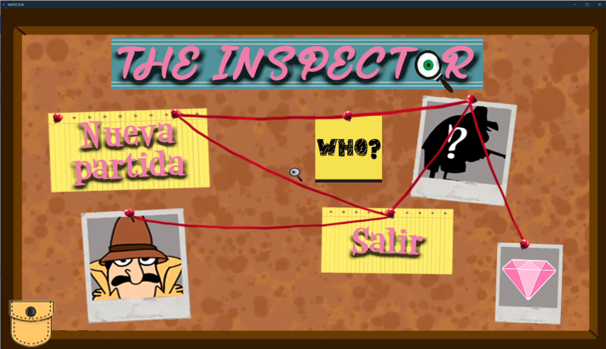
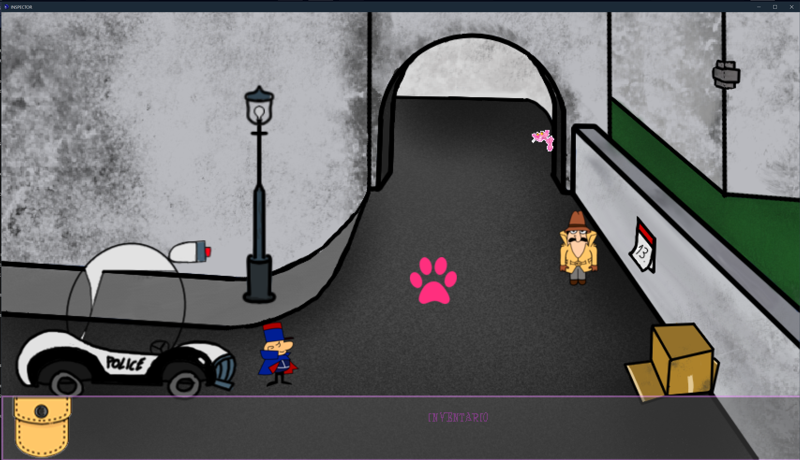
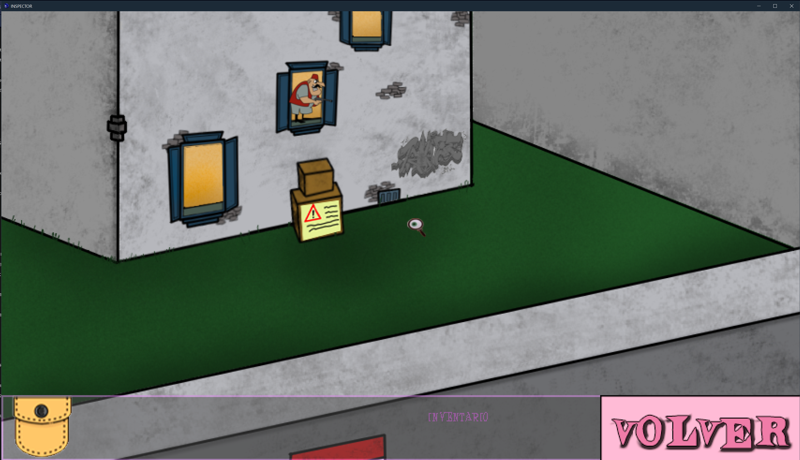

# The Inspector – Demo AGS

Pequeña demo creada con **Adventure Game Studio (AGS)** inspirada en un capítulo de **La Pantera Rosa**.

Es una pequeña aventura **point & click en primera persona** donde el jugador explora varias rooms, interactúa con objetos usando distintos cursores y resuelve algunos puzzles sencillos.

## Características

- Varias rooms explorables
- Sistema de inventario
- Diferentes cursores de interacción
- Puzzles sencillos
- Guiños al universo de **La Pantera Rosa**

## Capturas

## Motor

Proyecto realizado con **Adventure Game Studio (AGS)**.