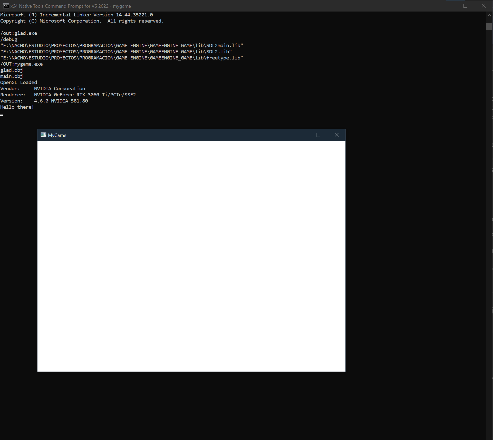

# 🎮 Game Engine From Scratch (C + OpenGL + SDL2)

## 🧩 Descripción del Proyecto
Este proyecto consiste en la creación de un **motor de videojuegos desde cero**, programado en **C** y utilizando las librerías **OpenGL**, **SDL2**, **GLAD** y **FreeType**.  
El desarrollo sigue la serie de tutoriales de **Dylan Falconer**, aprendiendo los fundamentos reales detrás de un motor profesional: inicialización del sistema, renderizado, manejo de recursos, entrada del usuario y estructura modular del engine.

El objetivo es comprender cómo funciona un game engine **desde el nivel más bajo**, sin depender de Unity, Unreal o Godot.

---

# 📁 Archivos descargados y su función

Este proyecto incluye varias dependencias que forman la base del motor. A continuación se describen todas y su rol en el proyecto:

---

## 🔹 SDL2 — Sistema, Entrada y Ventana  
**Proporciona:**
- Creación de la ventana  
- Administración del contexto OpenGL  
- Entrada (teclado, ratón, mandos…)  
- Manejo de eventos y del sistema  

**Incluye en el proyecto:**
- `SDL2.dll`
- `SDL2.lib`
- `SDL2main.lib`
- Carpeta `include/SDL2/` con todos los headers

---

## 🔹 GLAD — Cargador de Funciones OpenGL  
**Proporciona:**
- Acceso al pipeline moderno de OpenGL (3.x/4.x)  
- Carga dinámica de funciones del driver  

**Incluye:**
- Carpeta `glad/`  
- `glad.c`  
- `khrplatform.h`  
- `glad.h`

---

## 🔹 OpenGL — Renderizado  
**Proporciona:**
- Todo el pipeline gráfico  
- Shaders  
- Buffers (VBO, VAO)  
- Dibujado en GPU  

Se integra mediante:
- SDL2 (contexto)  
- GLAD (cargador)

---

## 🔹 FreeType — Renderizado de texto  
**Proporciona:**
- Lectura de fuentes `.ttf`  
- Generación de glifos para texto 2D/3D  

Incluye:
- Carpeta `freetype/`  
- `freetype.dll`  
- Headers en `freetype/include/`

---

# 🧱 Arquitectura del Motor
El motor se estructura de forma clara y modular:

