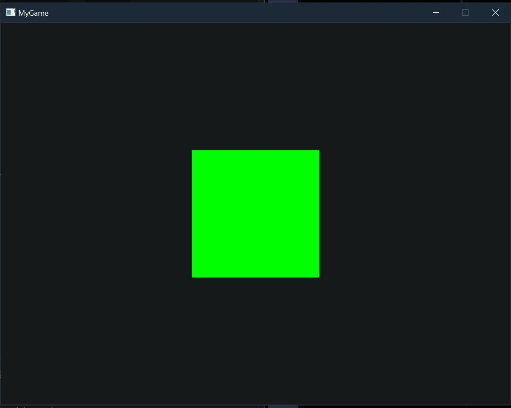

# 🎮 Game Engine From Scratch — C + OpenGL + SDL2


## 🧩 Descripción

Proyecto de aprendizaje centrado en la creación de un **motor de videojuegos desde cero utilizando C, OpenGL y SDL2**.

El desarrollo sigue como referencia la serie de tutoriales de **Dylan Falconer**, con el objetivo de comprender qué ocurre detrás de motores como Unity, Unreal Engine o Godot y trabajar directamente con conceptos de programación gráfica y arquitectura de motores.

Durante el proyecto se utilizan principalmente:

- **C** — lenguaje principal del motor.
- **SDL2** — creación de ventanas, contexto OpenGL y eventos.
- **OpenGL** — API gráfica utilizada para el renderizado.
- **GLAD** — carga de las funciones modernas de OpenGL.
- **GLSL** — programación de Vertex y Fragment Shaders.
- **FreeType** — preparada para el posterior sistema de renderizado de texto.

---

# 📂 Etapas del proyecto

El desarrollo se encuentra dividido en **versiones independientes**.

Cada carpeta contiene una copia completa del proyecto correspondiente a ese momento del desarrollo.

De esta forma es posible conservar, ejecutar y estudiar cada etapa por separado y observar progresivamente cómo evoluciona el motor.

---

## 🪟 01 — SDL2 Setup & Windows

`GAMEENGINE_SDL2SetUpAndWindows/`

Primera versión funcional del proyecto.

En esta etapa se prepara el entorno de desarrollo y se consigue crear una ventana con un contexto OpenGL funcional.

### Implementado

- Configuración inicial del proyecto en C.
- Integración de SDL2.
- Integración de GLAD.
- Creación de una ventana.
- Creación del contexto OpenGL.
- Carga de las funciones OpenGL mediante GLAD.
- Consulta de información de la GPU.
- Bucle principal de ejecución.
- Gestión del evento de cierre de ventana.
- Sistema de compilación mediante `build.bat`.

La aplicación puede consultar directamente información proporcionada por el driver gráfico:

```text
OpenGL Loaded
Vendor:   NVIDIA Corporation
Renderer: NVIDIA GeForce RTX 3060 Ti/PCIe/SSE2
Version:  4.6.0 NVIDIA 610.74
```

---

## 🟩 02 — Rendering a Quad & Shaders

`GAMEENGINE_RenderingAQuad&Shaders&.../`



Segunda etapa del proyecto.

El programa deja de limitarse a crear una ventana y comienza a implementar un **renderer 2D utilizando OpenGL**.

### Implementado

- Modularización inicial del engine.
- Estado global del motor.
- Tipos personalizados.
- Utilidades comunes.
- Sistema de lectura de archivos.
- Módulo de renderizado.
- Estado interno del renderer.
- VAO.
- VBO.
- EBO.
- Vertex attributes.
- Vertex Shader.
- Fragment Shader.
- Lectura de shaders desde archivos.
- Compilación y linking de shaders.
- Matriz de proyección ortográfica.
- Matriz de modelo.
- Uniforms.
- Coordenadas UV.
- Textura base 1x1.
- Renderizado mediante `glDrawElements`.
- Primer quad 2D renderizado correctamente.

El pipeline comienza a tener una estructura similar a:

```text
Vertices / Indices
        │
        ▼
   VAO / VBO / EBO
        │
        ▼
   Vertex Shader
        │
        ▼
  Rasterization
        │
        ▼
  Fragment Shader
        │
        ▼
      GPU
        │
        ▼
     Pantalla
```

---

# 🔧 Adaptaciones y reconstrucción

El proyecto sigue un tutorial como referencia, pero el repositorio también contiene **correcciones, adaptaciones y reconstrucciones realizadas durante el proceso de aprendizaje**.

Durante la segunda etapa se detectó que se había omitido accidentalmente uno de los vídeos intermedios del tutorial.

Esto provocó que varios archivos utilizados posteriormente no existieran todavía en la copia local del proyecto.

Antes de detectar el salto, parte de esta estructura fue reconstruida manualmente para poder continuar con el renderer.

Posteriormente, estas implementaciones se comparan con las utilizadas en el tutorial y se adaptan cuando sea necesario.

Entre los trabajos realizados durante este proceso se encuentran:

- Reconstrucción de archivos y módulos ausentes.
- Corrección de rutas relativas.
- Adaptación del sistema de compilación.
- Inclusión de nuevos módulos en `build.bat`.
- Corrección de errores de sintaxis durante la transcripción.
- Configuración de VAO, VBO y EBO.
- Configuración de atributos de vértice.
- Correcciones en la carga y compilación de shaders.
- Configuración de matrices y uniforms.
- Depuración del sistema de color y textura.
- Adaptaciones necesarias para MSVC y Windows.

Estas modificaciones se documentan para diferenciar el código procedente directamente del tutorial de las soluciones desarrolladas durante la implementación y depuración del proyecto.

---

# 🧠 Objetivo de aprendizaje

El objetivo no es únicamente conseguir un motor funcional.

El proyecto busca comprender los sistemas que normalmente quedan ocultos al trabajar con motores comerciales.

Entre los conceptos estudiados se encuentran:

- Arquitectura de un motor.
- Programación en C.
- Gestión de memoria.
- Punteros.
- Buffers.
- Contextos gráficos.
- Pipeline gráfico.
- Shaders.
- Recursos de GPU.
- Matrices de transformación.
- Sistemas de coordenadas.
- Compilación y linking.

---

# 📁 Estructura general

```text
GAME_ENGINE/
│
├── README.md
│
├── Screenshots/
│   ├── portada.png
│   └── portada2.png
│
├── GAMEENGINE_SDL2SetUpAndWindows/
│   └── ...
│
└── GAMEENGINE_RenderingAQuad&Shaders&.../
    └── ...
```

Cada versión puede contener además su propio `README.md` documentando específicamente lo desarrollado en esa etapa.

---

# 🚧 Estado actual

```text
SDL2 Window          ✅
OpenGL Context       ✅
GLAD                  ✅
Main Loop             ✅
Engine Modules        ✅
File IO               ✅
VAO / VBO / EBO       ✅
GLSL Shaders          ✅
Orthographic Matrix   ✅
Model Matrix          ✅
Uniform Color         ✅
Quad Rendering        ✅
Textures              🚧
```

El último milestone alcanzado es el **renderizado de un quad 2D mediante el renderer propio del motor**.

---

# 🎯 Objetivo

Continuar desarrollando progresivamente el engine mientras se estudia la implementación de sus diferentes subsistemas.

El proyecto tiene principalmente un propósito **educativo y de portfolio**, documentando tanto los resultados como el proceso de aprendizaje, los problemas encontrados y las soluciones implementadas.