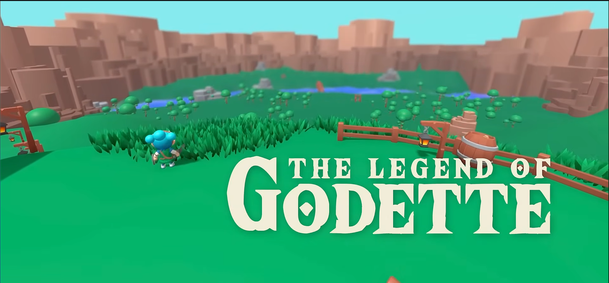

# Godot 3D – Proyecto estilo Breath of the Wild

Este proyecto es un ejercicio práctico basado en un tutorial de desarrollo 3D en **Godot**, donde se crea un juego inspirado en *Breath of the Wild*.  
A lo largo del desarrollo se aprenden las bases del 3D, movimiento, animaciones, combate, enemigos, niveles y efectos visuales.

## 🧭 Contenido del tutorial
- 3D basics  
- Player movement  
- Player animations  
- Enemigos  
- Armas, proyectiles e interacciones  
- Interfaz de usuario  
- Creación de niveles  
- VFX (Shaders + partículas)

## ⏱️ Timestamps
- 00:00:00 – Intro  
- 00:02:49 – 3D basics  
- 00:39:39 – Player movement  
- 01:32:51 – Player animations  
- 03:26:31 – Enemies  
- 04:34:34 – Weapons & projectiles  
- 05:50:46 – UI  
- 06:44:20 – Level building  
- 08:45:22 – VFX (Shaders & particles)

Gracias nuevamente a **Clear Code**, cuyo contenido educativo facilita enormemente el aprendizaje de Godot y el desarrollo de videojuegos.

## 📁 Archivos del proyecto
Enlace original del autor:
https://drive.google.com/drive/folder...

