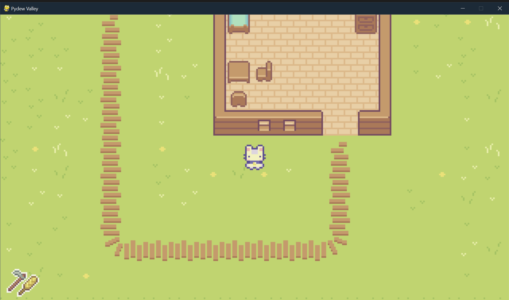
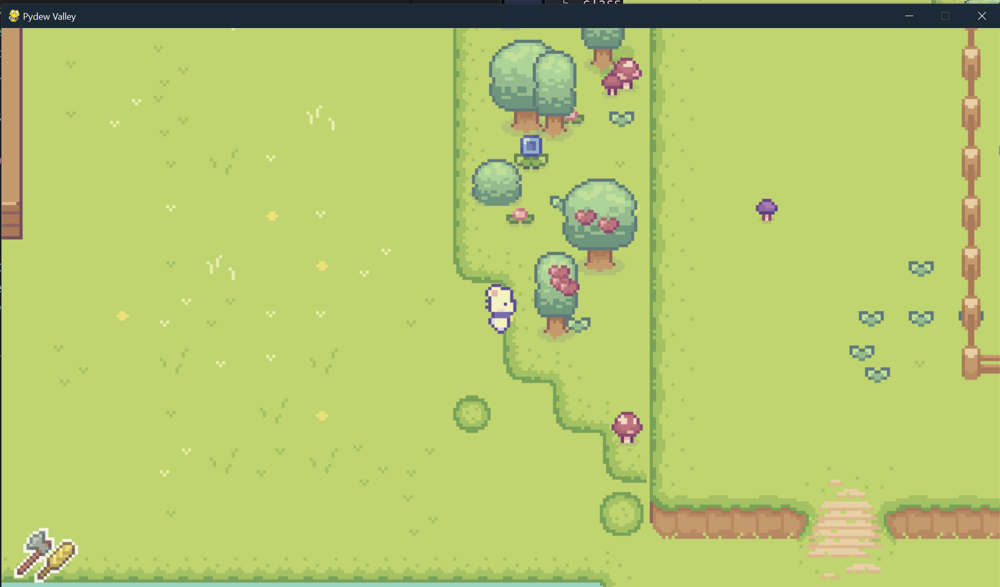
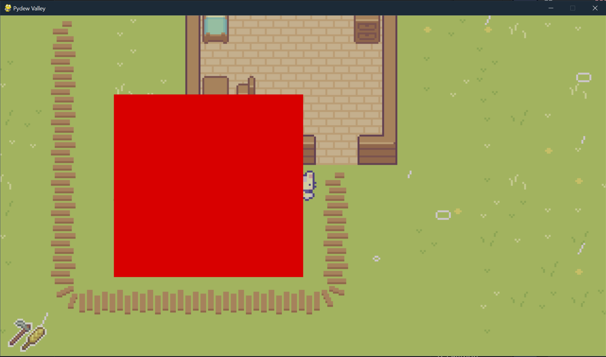
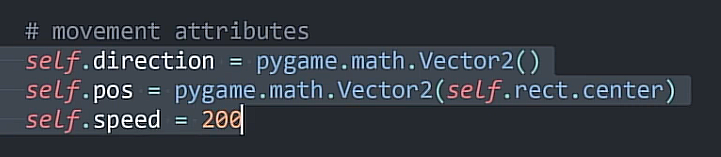
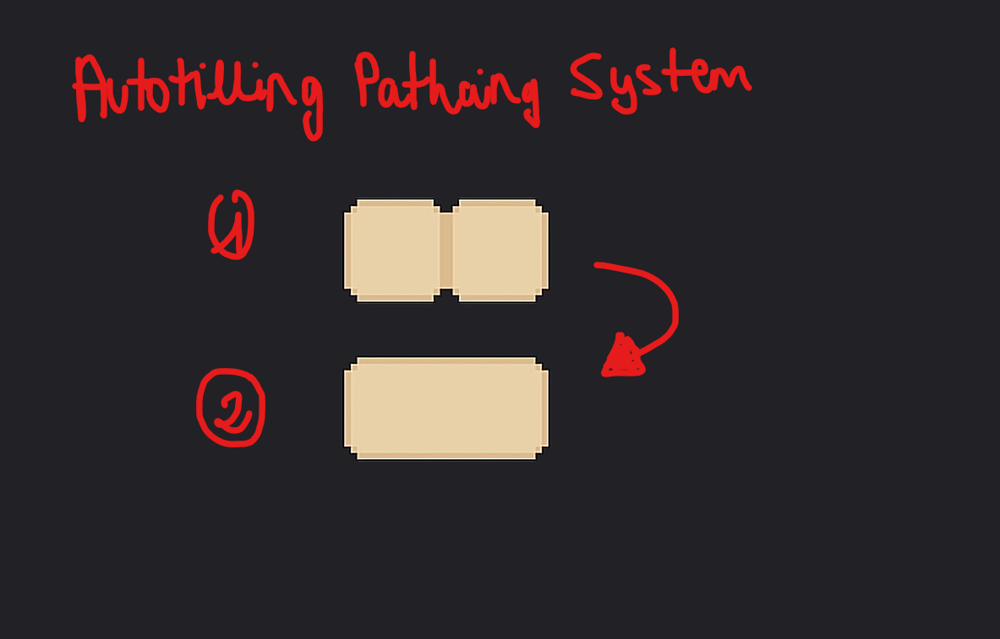
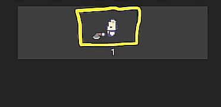

# 🌱 PyDew Valley – Pygame Project

Proyecto personal en **Pygame** inspirado en *Stardew Valley*.  
Actualmente centrado en movimiento, colisiones, tiles, herramientas y mecánicas base del jugador.

---

## 📌 Progreso del proyecto  
**✔️ 100% (proyecto base completado)**

- Movimiento fluido del jugador  
- Sistema de colisiones optimizado  
- Normalización de vectores  
- Sistema de tiles y colisión por capas  
- Uso de herramientas (azada, hacha, riego)  
- Sistema de cultivos  
- Menú de depuración  
- Sistema día / noche  
- Transiciones y efectos visuales  
- Audio integrado (FX + música)  
- Código modular e intento de organización  

---

## 🎥 Gameplay

▶️ **Gameplay completo del proyecto**  
*(enlace pendiente)*

👉 Canal de YouTube:  
https://www.youtube.com/@nachoslkn
---

## 📸 Capturas del proyecto

### 🎮 Gameplay y sistemas principales

---

## 📘 Teoría y anotaciones importantes

### 🔹 Atributos clave para movimiento

### 🔹 Autotilling / Patching system

---

### 🔹 Colisiones básicas

### 🔹 Colisiones avanzadas

### 🔹 Colisiones con bounding box

### 🔹 Tiles de colisión

### 🔹 Normalización de vector (Pitágoras)
.png)

---

## 🎯 Objetivo del proyecto

Construir una **base sólida y extensible** para un juego estilo **Stardew Valley**, utilizando:

- Python 3  
- Pygame  
- Arquitectura modular  
- Spritesheets y animaciones  
- Física 2D simple  
- Mapas creados con **Tiled**  

Este proyecto sirve como **aprendizaje avanzado de Pygame** y como base para futuros proyectos más grandes.

