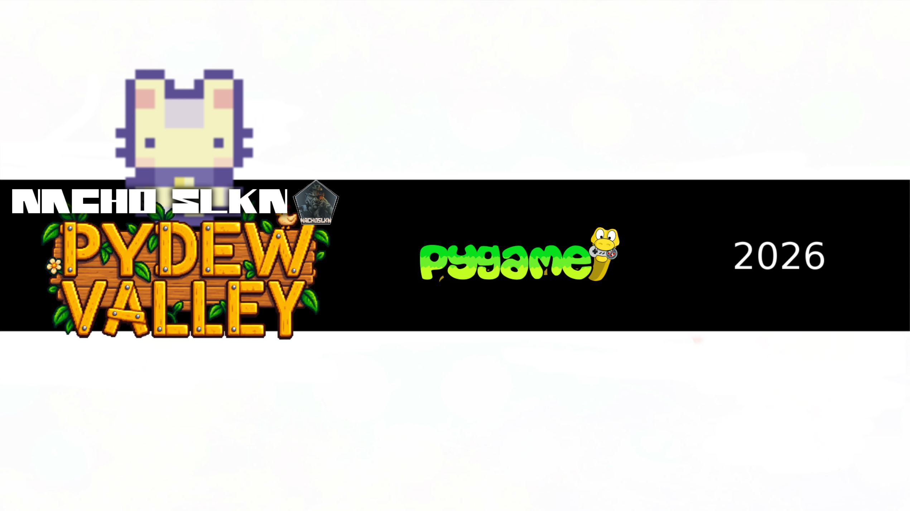
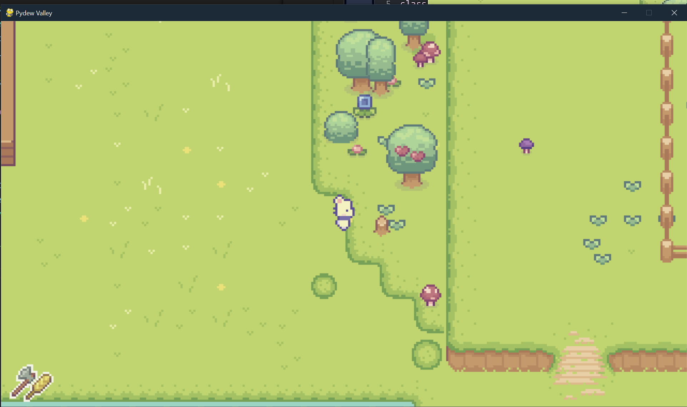
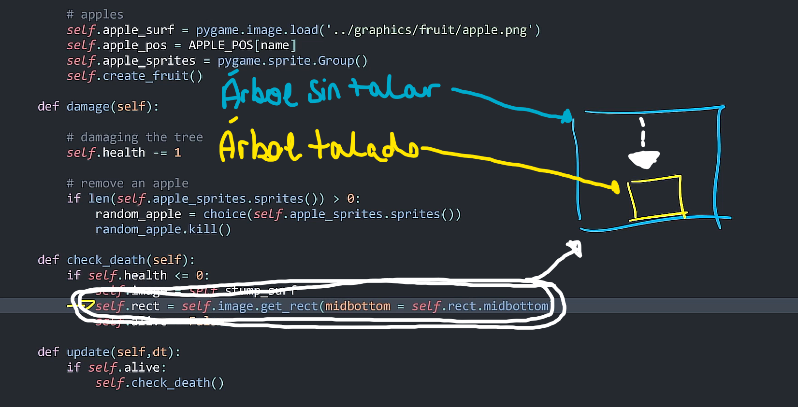
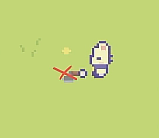
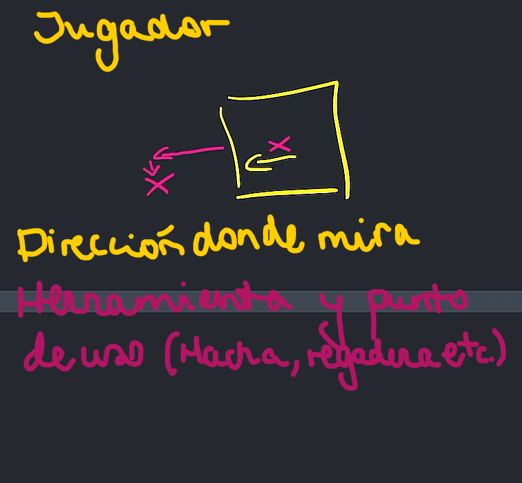
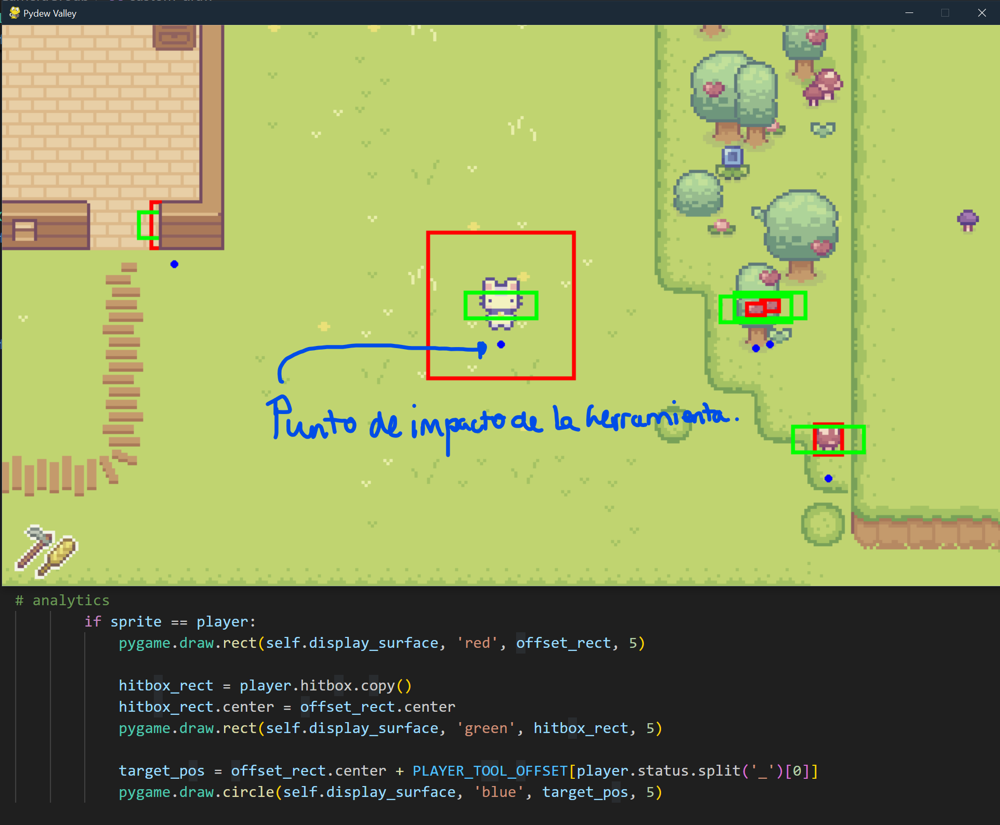
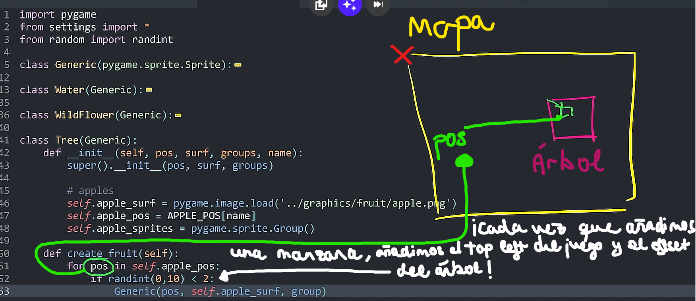
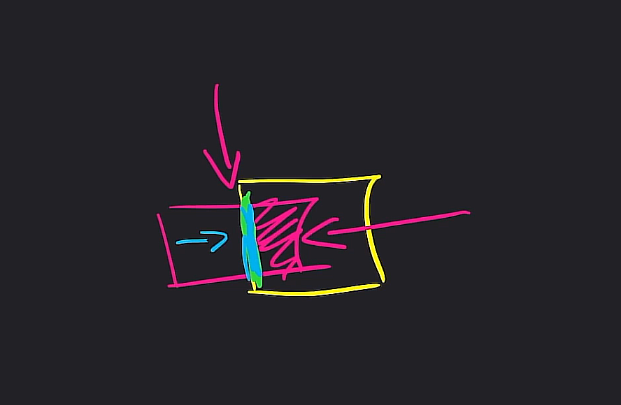
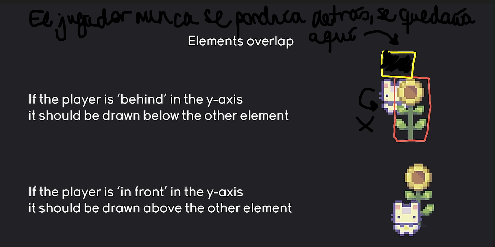
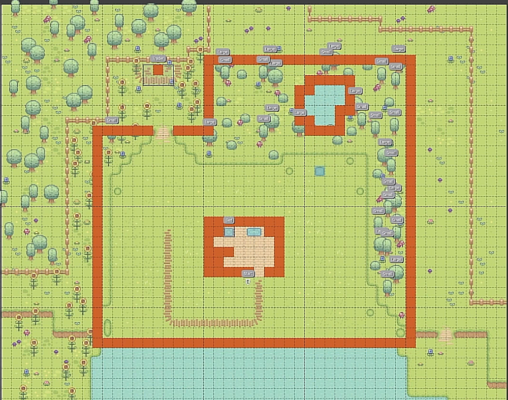

# 🌱 PyDew Valley – Pygame Project




Proyecto personal desarrollado con **Python** y **Pygame**, inspirado en **Stardew Valley**.

El objetivo de este proyecto ha sido construir una base sólida para futuros juegos 2D, implementando desde cero los sistemas principales de un juego de granja moderno mediante una arquitectura modular y fácilmente ampliable.

---

# 🔗 Enlaces

## 🎮 Jugar online (HTML5)

https://nachoslkn.itch.io/pydew-valley

## 💾 Descargar versión Windows

https://nachoslkn.itch.io/pydew-valley

## 🎥 Gameplay v0.1

https://youtu.be/X5yHedo7cYY

## 🌐 Portfolio

https://nachoslkn.com

## 📺 Canal de YouTube

https://www.youtube.com/@nachoslkn

---

# 📌 Estado del proyecto

## ✔️ Demo publicada

Actualmente el proyecto incluye:

- ✅ Movimiento del jugador
- ✅ Colisiones optimizadas
- ✅ Herramientas
- ✅ Sistema de cultivos
- ✅ Ciclo día / noche
- ✅ Lluvia
- ✅ Sistema de partículas
- ✅ Audio
- ✅ Menús
- ✅ Guardado de partida
- ✅ Exportación Windows (.exe)
- ✅ Exportación HTML5 (Web)

---

# 🛠 Tecnologías

- Python 3
- Pygame
- PyTMX
- Tiled
- PyInstaller
- Pygbag (versión Web)

---

# 🎥 Gameplay

### PyDew Valley v0.1

https://youtu.be/X5yHedo7cYY

---

# 📸 Capturas

## Gameplay






---







---


---



---

# 📘 Conceptos implementados

## Movimiento

### Atributos para movimiento


---

## Sistema de terreno

### Autotiling


---

## Colisiones

### Colisiones básicas


---

### Colisiones avanzadas



---

### Bounding Box



---

### Collision Tiles



---

## Matemáticas

### Normalización de vectores

.png)

---

# 🎯 Objetivos del proyecto

Este proyecto nace con la intención de servir como una base reutilizable para futuros videojuegos desarrollados con **Pygame**.

Los principales objetivos han sido:

- Arquitectura modular
- Organización del código
- Sistemas reutilizables
- Optimización de colisiones
- Gestión de mapas con Tiled
- Sistemas de interacción
- Uso de spritesheets
- Animaciones
- Audio
- Partículas
- Transiciones

---

# 🚀 Roadmap

## Próximas características

- NPCs
- Sistema de diálogos
- Inventario completo
- Animales
- Más cultivos
- Estaciones
- Nuevos mapas
- Sistema de economía
- Mejor IA
- Mejor sistema de guardado

---

# 📂 Estructura del repositorio

```text
PyDew-Valley
│
├── PyDew-Valley-PC
│   ├── Código fuente
│   └── Build Windows
│
├── PyDew-Valley-WEB
│   ├── Código fuente
│   └── Exportación HTML5
│
└── Screenshots
```

---

# 👨‍💻 Autor

**Nacho SLKN**

🎮 Game Developer

🌐 https://nachoslkn.com

📺 https://www.youtube.com/@nachoslkn

💻 https://github.com/NachoSLKN

---

Si te interesa el desarrollo de videojuegos con **Python**, **Unity**, **Godot** o **Blender**, puedes seguir mi progreso en el canal de YouTube y en mi portfolio, donde publico versiones jugables de todos mis proyectos.