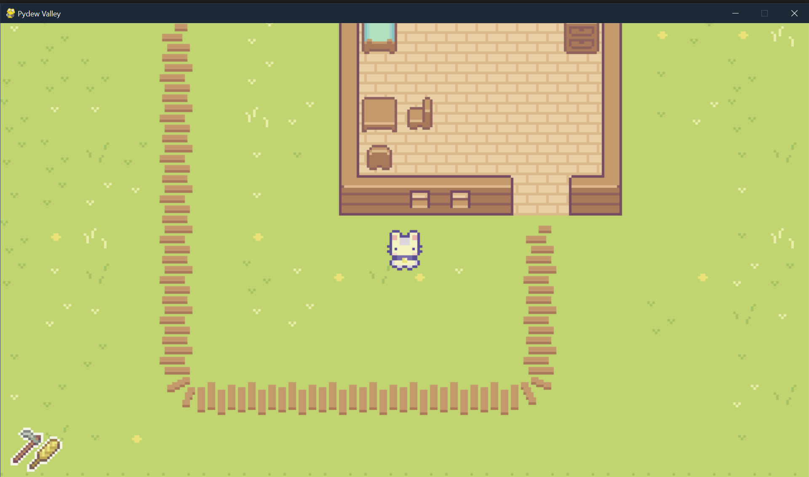
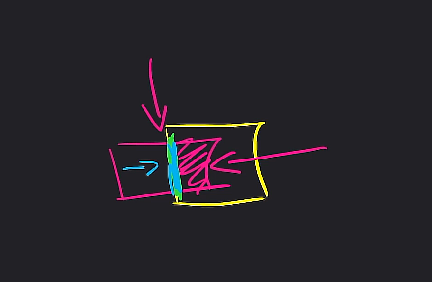

# PyDew Valley – Pygame Project

Proyecto personal en Pygame inspirado en Stardew Valley.  
Actualmente centrado en movimiento, colisiones, interacción con tiles y mecánicas base del jugador.

---

## 📌 Progreso del proyecto  
**✔️ 45% completado**

- Movimiento fluido del jugador  
- Sistema de colisiones mejorado  
- Normalización de vectores  
- Sistema de tiles y detección precisa  
- Preparación para interacción con entorno  
- Estructura del proyecto reorganizada  

---

## 📘 Teoría y anotaciones importantes

### 🔹 Colisiones básicas

### 🔹 Colisiones avanzadas

### 🔹 Colisiones con bounding box

### 🔹 Tiles de colisión

### 🔹 Normalización de vector (Pitágoras)
.png)

---

## 🎮 Objetivo del proyecto

Construir una base sólida para un juego estilo **Stardew Valley** utilizando:

- Python 3  
- Pygame  
- Arquitectura organizada en módulos  
- Spritesheet y sistema de animación  
- Física 2D simple  
- Mapas creados con Tiled  

---

## 🙌 Agradecimientos

Agradecimientos especiales a los creadores de contenido y tutoriales que ayudaron en la fase inicial del proyecto.

---

