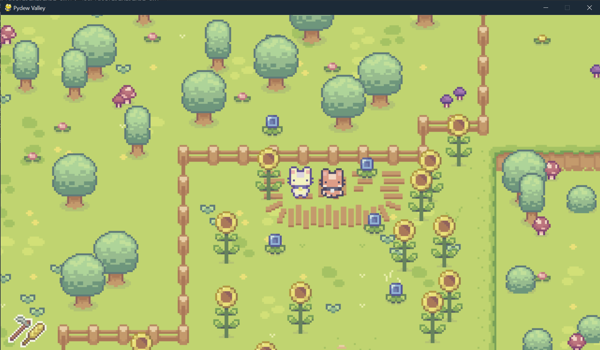

# PyDew Valley – Proyecto en Pygame

**PyDew Valley** es un proyecto en desarrollo creado con **Pygame**, inspirado en el clásico *Stardew Valley*.  
El objetivo es recrear un pequeño simulador de granja en 2D, con sistemas de cultivo, recursos, ciclos, herramientas y NPCs.

Actualmente el proyecto se encuentra aproximadamente al **33% de desarrollo**.

---

## 🌾 Características del Proyecto (hasta ahora)

- Movimiento del jugador en un mapa 2D
- Animaciones básicas del personaje
- Sistema de herramientas (azada, regadera, hacha…)
- Interacción con tiles del entorno
- Sistema de energía del jugador
- Plantación y crecimiento de cultivos
- Gráficos y sprites personalizados
- Mapa dividido por capas (ground, objects, collision, etc.)

---

## 📌 Próximos Objetivos

- IA de NPCs
- Sistema de misiones y relaciones
- Ciclo día/noche y estaciones
- Inventario y sistema de crafting
- Sonido y música
- Menú principal y ajustes
- Optimización general

---

