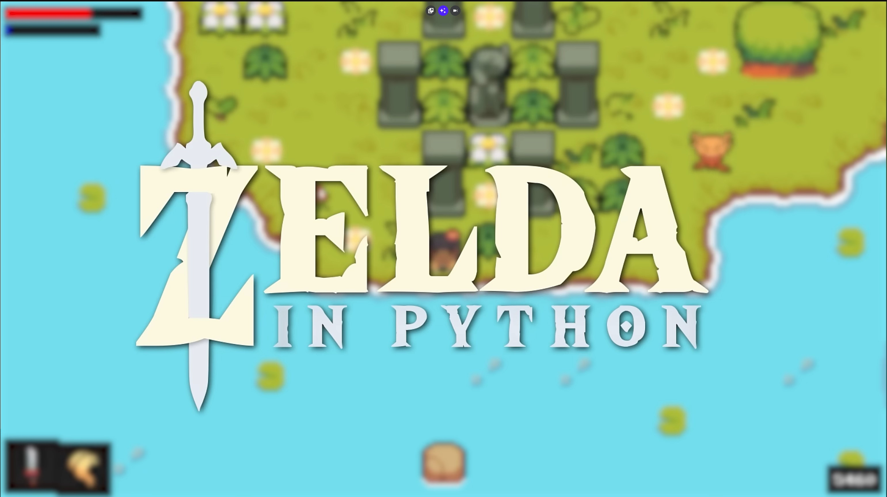

# Zelda 2D en Pygame

Este proyecto es un **juego 2D estilo Zelda**, desarrollado utilizando **Pygame**.  
El objetivo es aprender y construir paso a paso un juego con movimiento, combate, magia, enemigos, interfaz y sistemas avanzados como mejoras y partículas.

---

## 🎮 Descripción del juego
Se trata de una aventura 2D inspirada en los clásicos Zelda.  
Incluye exploración, combate con armas, magia, enemigos con IA básica, efectos visuales, partículas y un menú de mejoras.

El proyecto está estructurado modularmente para facilitar la lectura, el aprendizaje y la expansión del juego.

---

## 📝 Objetivos del desarrollo 

Introducción 
Configuración del proyecto 
Configuración del nivel 
Creación del jugador 
Creación de la cámara 
Gráficos 
Animaciones del jugador 
Armas 
Interfaz de usuario 
Configuración de la magia 
Creación del enemigo
Interacción jugador-enemigo 
Partículas 
Hechizos 
Sistema de mejoras y menú 
Correcciones finales y sonido 

---

## 🛠️ Tecnologías utilizadas
- **Python 3**
- **Pygame**
- Sprites y assets 2D
- Sistema de colisiones y cámaras
- Animaciones frame-by-frame

