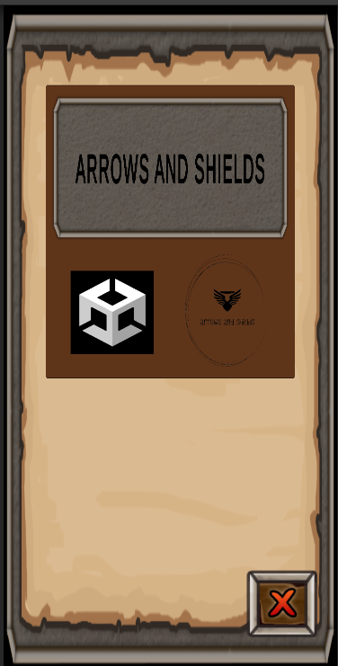
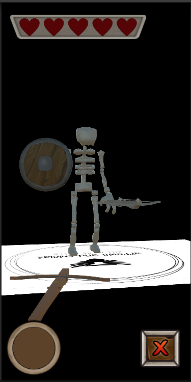
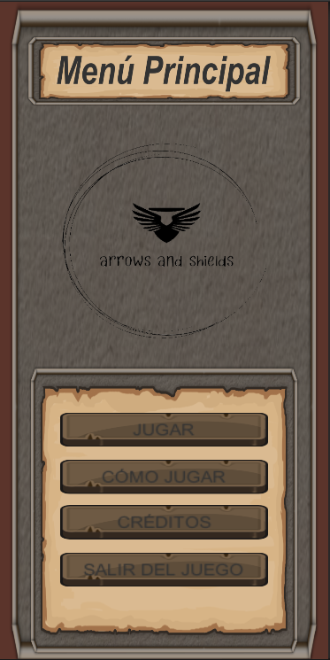
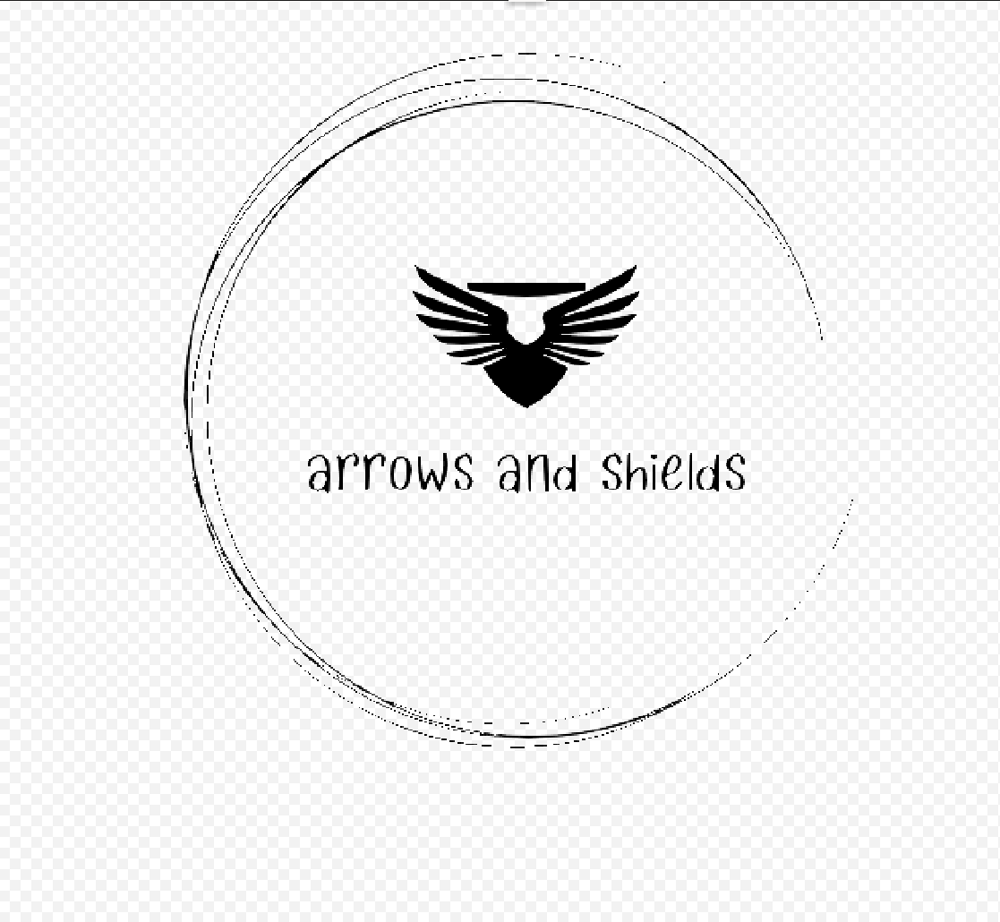

# 🏹 Arrows And Shields (AR)

Proyecto desarrollado en **Unity** como parte del repositorio **Desarrollo-Videojuegos**.  
Se trata de un prototipo **muy básico de Realidad Aumentada** orientado a dispositivos móviles.

---

## 📱 Descripción del proyecto

**Arrows And Shields** es un prototipo de juego en **Realidad Aumentada** donde el objetivo es derrotar a un **esqueleto enemigo** antes de que se acabe el tiempo.

El jugador utiliza una **ballesta** para disparar al enemigo dentro del entorno real.

Para que el esqueleto aparezca, es necesario usar la **imagen marcador `AAS.png`**.

---

## 🕹️ Mecánicas actuales

- Aparición del enemigo mediante imagen AR (`AAS.png`)
- Enemigo estático (esqueleto)
- Temporizador de partida
- Disparo con ballesta
- Objetivo simple: derrotar al enemigo antes de que acabe el tiempo

---

## 📸 Capturas del proyecto

---

## 🚀 Mejoras previstas

- Sistema de **vida** para jugador y enemigo
- Posibilidad de **ser derrotado** por el enemigo
- Animaciones para el esqueleto
- Mejora sustancial de la programación
- Optimización y adaptación a **nuevos dispositivos móviles**
- Ampliación de mecánicas y dificultad

---

## 🛠️ Tecnologías utilizadas

- **Unity**
- **C#**
- **Realidad Aumentada (AR)**

---

## 📌 Estado del proyecto

🟡 **Prototipo / en fase inicial**

Proyecto incluido dentro del repositorio **Desarrollo-Videojuegos**, utilizado como base de aprendizaje y experimentación con AR en Unity.
