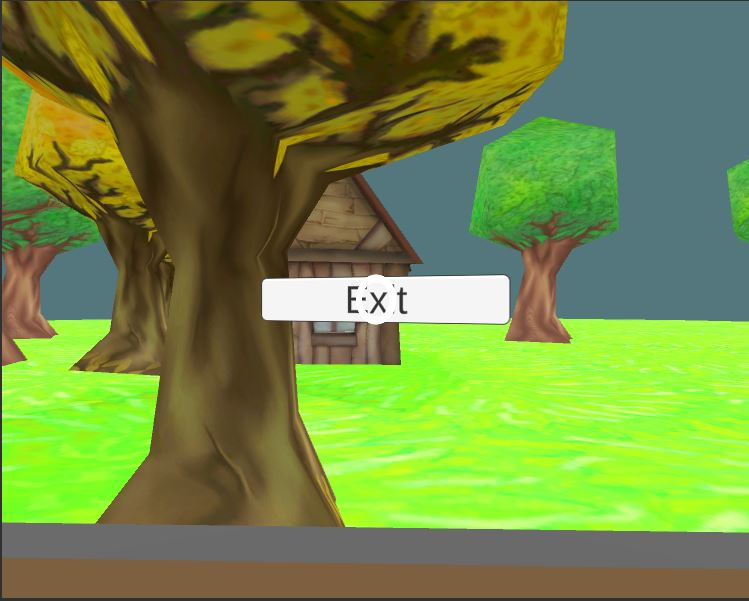
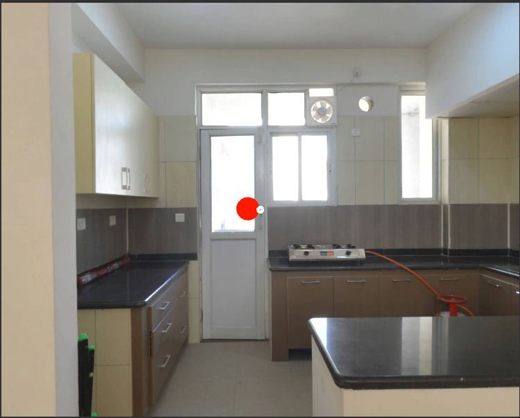
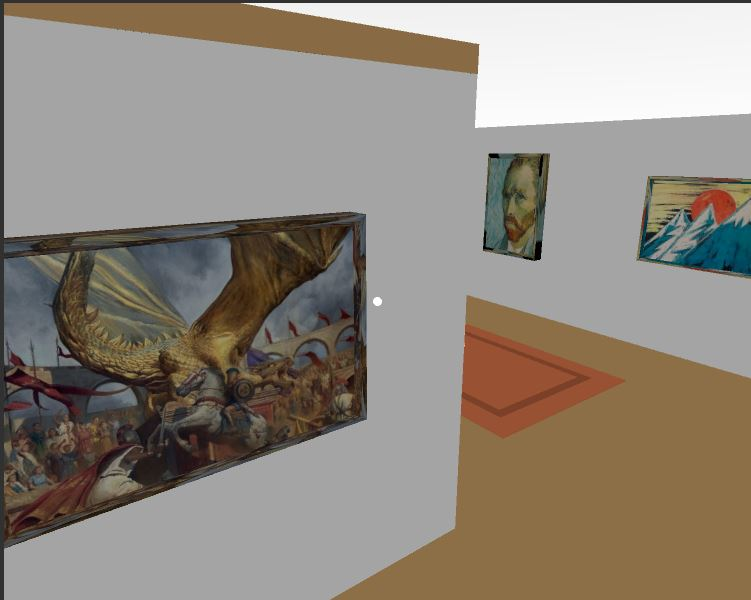
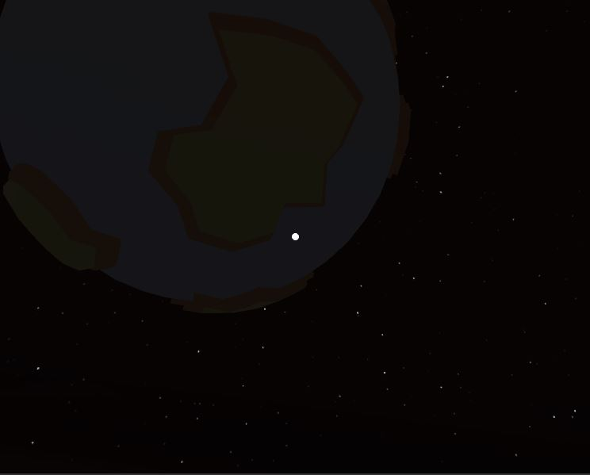
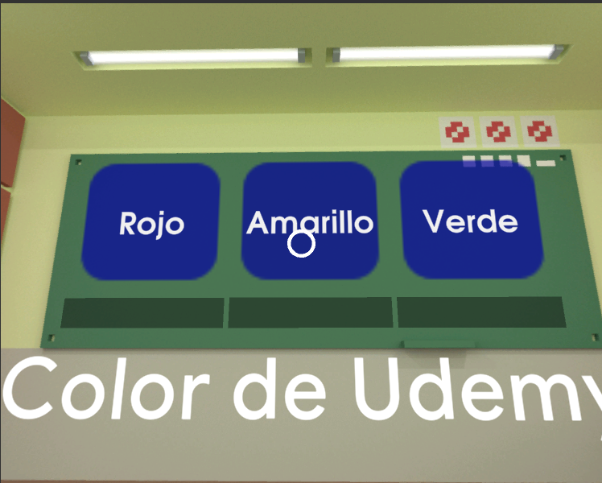

# Google VR — Unity Virtual Reality Projects

A collection of virtual reality projects developed in Unity during my training in VR development with Google VR.

The project contains several independent VR experiences exploring locomotion, virtual tours, interaction, educational experiences, gaze-based interfaces, Timeline sequences and WebGL deployment.

---

## VR Locomotion

A VR locomotion prototype featuring a guided mine-cart experience.

The player travels through the environment using a path-based movement system while retaining independent camera control.

### Main concepts
- VR locomotion
- Google VR
- Cinemachine Dolly Cart
- Path-based movement
- Desktop and WebGL camera controls

---

## Real Estate VR

A virtual reality real-estate experience designed to explore an interior environment.

The project focuses on VR navigation, teleportation and interaction inside a virtual property.

### Main concepts
- Virtual tours
- VR teleportation
- Environment interaction
- Google VR
- Unity UI

---

## VR Art Gallery

An interactive virtual art gallery where the player can explore an exhibition and interact with different artworks.

### Main concepts
- Interactive VR environments
- Art gallery visualization
- Teleportation
- Artwork interaction
- VR UI

---

## Educational Space Experience

An educational VR experience built around a guided journey through space.

The player travels through the environment while planets progressively appear during the journey. Unity Timeline and Cinemachine coordinate the route and presentation.

### Main concepts
- Educational VR
- Cinemachine
- Unity Timeline
- Animated planets
- Guided experiences
- Sequenced environment events

---

## VR Quiz

A gaze-based interactive VR quiz.

The player selects answers by looking at them for a specified amount of time. Questions are loaded from JSON, the system tracks correct and incorrect answers, and the final results are displayed at the end of the quiz.

The JSON loading system was adapted for WebGL using UnityWebRequest.

### Main concepts
- Gaze interaction
- Timed selection
- JSON question database
- Unity Timeline and Signals
- Score tracking
- WebGL support

---

## Technologies

- Unity 2019.3
- C#
- Google VR for Unity
- Cinemachine
- Unity Timeline
- TextMesh Pro
- JSON
- UnityWebRequest
- WebGL

---

## Builds

The applications have been tested as WebGL builds for browser-based portfolio presentation.

Standalone Windows builds can also be generated for desktop use.

---

## Certificate

**EXPERTO en Realidad Virtual con Unity y Google VR**  
Udemy — September 2026  
Instructor: Mariano Sosa

[View / Download Certificate (PDF)](Certificate/UC-1dfb37ee-5726-4773-82f0-b7121343dd4a.pdf)

[Verify Certificate on Udemy](https://ude.my/UC-1dfb37ee-5726-4773-82f0-b7121343dd4a)

---

## Author

**Ignacio Liñán Vicente**

Game Development / Software Development

GitHub: **NachoSLKN**
