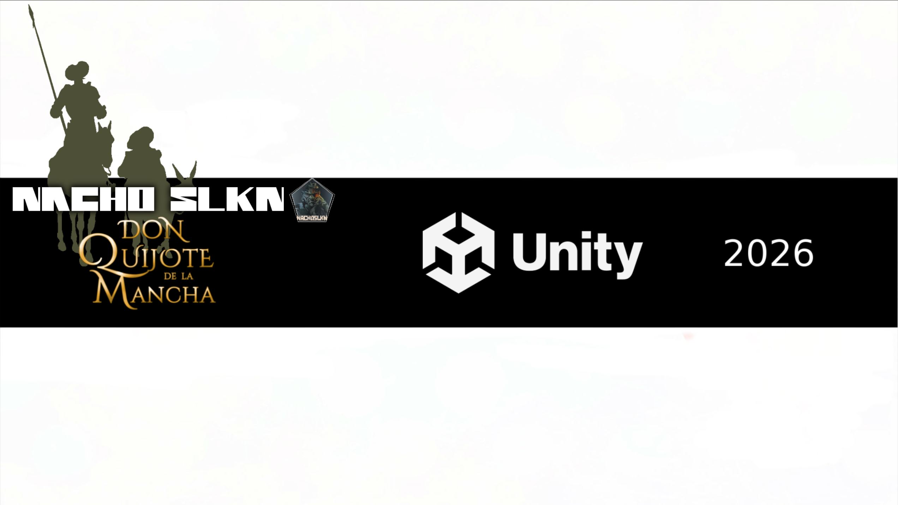

# ⚔️ Don Quijote

> Proyecto personal desarrollado en Unity inspirado en **Don Quijote de la Mancha**, la obra de Miguel de Cervantes.
>
> El objetivo es crear un videojuego de acción **hack & slash con perspectiva isométrica**, inspirado en títulos como **Diablo**, reinterpretando el universo de Don Quijote en una aventura llena de enemigos, exploración y combates.

---

## 📹 Devlog

🎥 Primer episodio del desarrollo:

https://youtube.com/live/R5Y4QydT8Pc?feature=share

---

## 🎮 Características

- Movimiento isométrico
- Combate cuerpo a cuerpo
- Cámara estilo Diablo
- Animaciones mediante Mixamo
- Personajes modelados y adaptados en Blender
- Enemigos y sistema de combate
- Escenarios medievales
- Desarrollo de mecánicas ARPG

---

## 🛠 Tecnologías

- Unity 6
- C#
- Blender
- Mixamo
- Git
- GitHub

---

## 📂 Estado del proyecto

🟡 En desarrollo.

Actualmente el proyecto se encuentra en una fase inicial donde se están construyendo las mecánicas principales del juego:

- movimiento del personaje
- combate
- animaciones
- integración de personajes
- escenarios
- sistemas de juego

El objetivo es desarrollar una demo vertical que represente la experiencia principal del proyecto.

---

## 📌 Objetivos

- [x] Personaje jugable
- [x] Sistema de movimiento
- [x] Integración Blender + Unity
- [ ] Sistema completo de combate
- [ ] IA de enemigos
- [ ] Escenario principal
- [ ] Habilidades y progresión
- [ ] Demo jugable

---

## 📚 Inspiración

Inspirado en la obra **Don Quijote de la Mancha**, reinterpretando su universo como un videojuego de acción **hack & slash** con perspectiva isométrica y elementos propios de los ARPG clásicos.

---

## 📜 Créditos

Proyecto desarrollado por **NachoSLKN** como parte de mi portfolio de desarrollo de videojuegos.

No es un proyecto comercial.
Todos los derechos de la obra original pertenecen a sus respectivos propietarios.