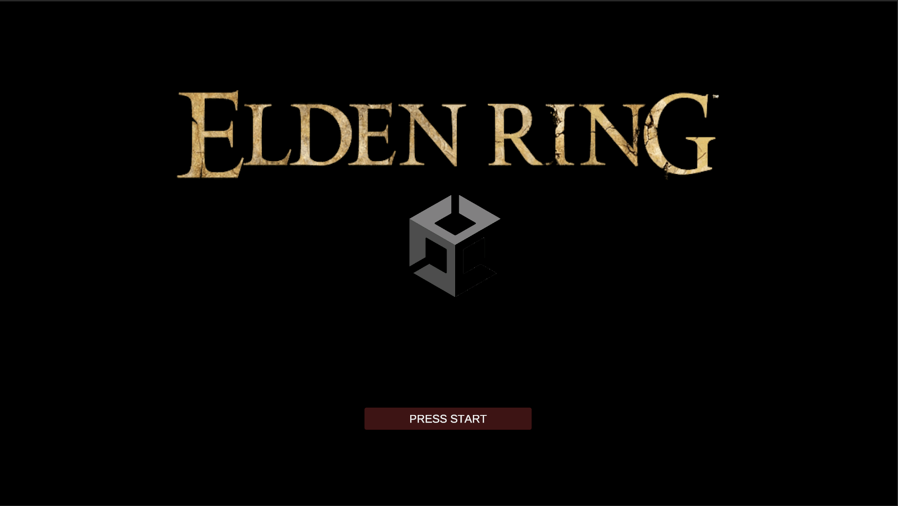
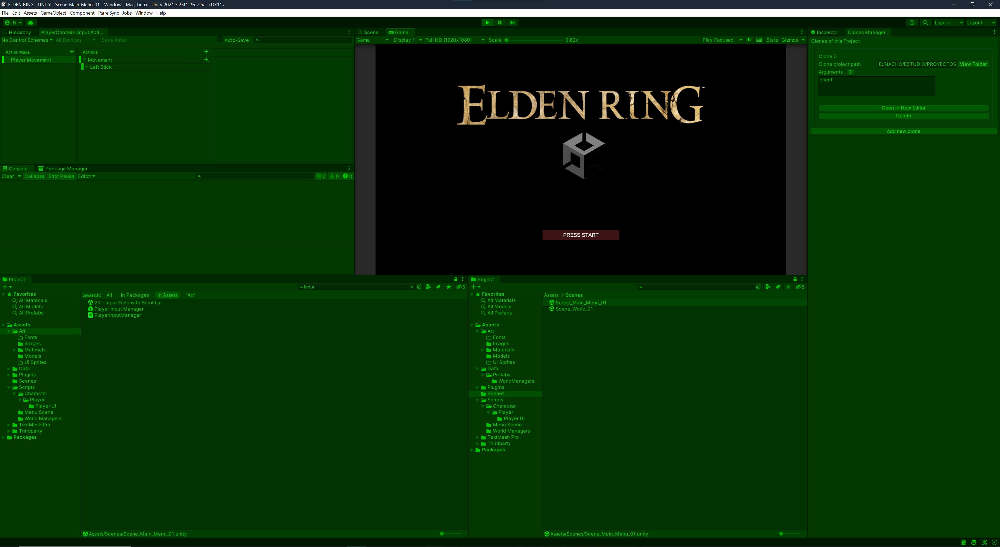
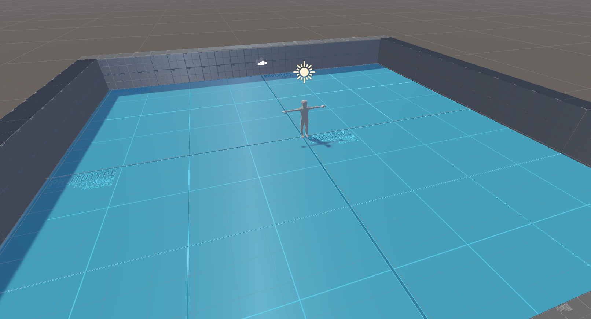
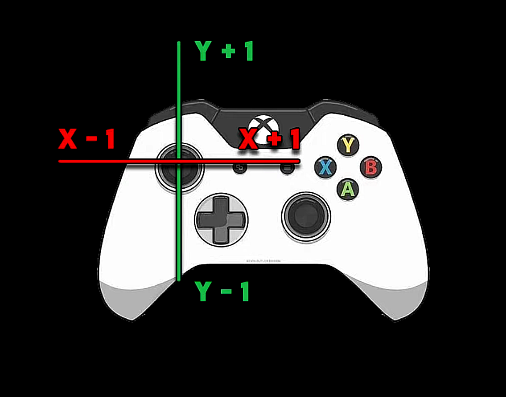

# Elden Ring en Unity

Proyecto personal cuyo objetivo es recrear de forma sencilla algunas mecánicas de **Elden Ring** en **Unity**, incorporando:

- Conectividad multijugador (Netcode for GameObjects + ParrelSync)  
- Sistema de animaciones  
- Mapeo completo del mando mediante **Input System**  
- Movimiento del jugador basado en valores de los joysticks  
- Escena principal y escena del mundo en desarrollo  

Este repositorio documenta mi progreso siguiendo y adaptando la serie del creador **Sebastian Graves**.

---

## 🎮 Menú principal (Menu Scene)

En esta escena mostramos:

- **Sistema de Input System funcionando con DualSense**  
- **Botón de inicio** que instancia un clon mediante **Clone Manager**  
- Preparación para pruebas de juego multijugador local usando ParrelSync  

---

## 🌍 World Scene (Escena de Mundo)

Aquí se realizan pruebas iniciales de:

- Movimiento del jugador  
- Lectura de inputs en tiempo real  
- Escenario base para futuras mecánicas de combate y exploración  

---

## 🎮 Controles e Input System

Gráfico donde se muestran:

- Los **ejes X e Y del joystick izquierdo**  
- Valores de input utilizados para mover al jugador  
- Lectura directa mediante `ctx.ReadValue<Vector2>()`  
- Mando DualSense configurado y reconocido por el sistema  

---

## 🙌 Agradecimientos

Gracias al creador **Sebastian Graves**, cuyo contenido y metodología inspiran y permiten el desarrollo de este proyecto.

---

## 📁 Estructura del repositorio

