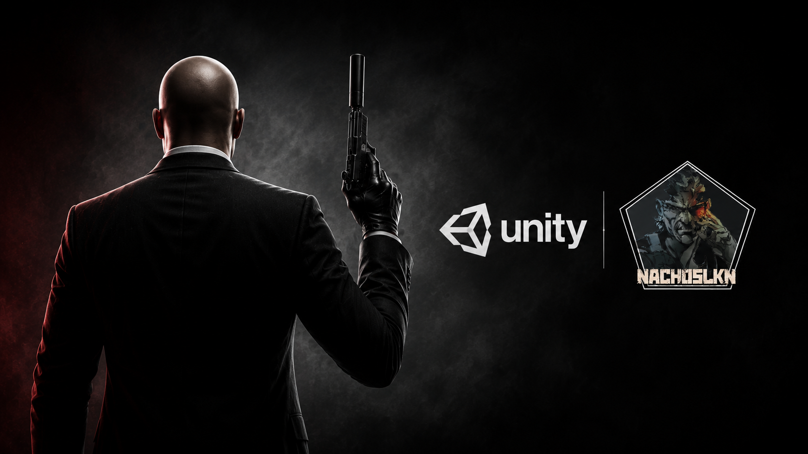

# Hitman 

## 🎮 Sobre el proyecto

Proyecto personal desarrollado en Unity inspirado en la saga **Hitman**.

El objetivo de este proyecto es aprender el desarrollo de videojuegos en tercera persona implementando mecánicas propias de un juego de infiltración como movimiento, sigilo, IA, disparos y navegación por escenarios.

El proyecto sigue como base el curso de WITS Gaming. 

---

## 🚀 Características

- Movimiento en tercera persona
- Cámara libre
- Sistema de disparo
- IA básica de enemigos
- Mecánicas de sigilo
- Patrullas
- Sistema de detección
- Interacción con el escenario
- Animaciones mediante Animator

---

## 🛠 Tecnologías

- Unity
- C#
- Blender
- Mixamo

---

## 📚 Curso utilizado

Este proyecto está basado inicialmente en la lista de reproducción:

https://www.youtube.com/playlist?list=PLA-xaldQ72rxijh0UIIw9LbBiomYjCrNq

A partir de esa base el proyecto continúa evolucionando de forma independiente.

---

## 📹 Desarrollo

Primer vídeo del desarrollo:

https://youtu.be/oCQWSZgxsfI

---

## 📌 Estado

🚧 En desarrollo

Este repositorio forma parte de mi portfolio personal de desarrollo de videojuegos.
