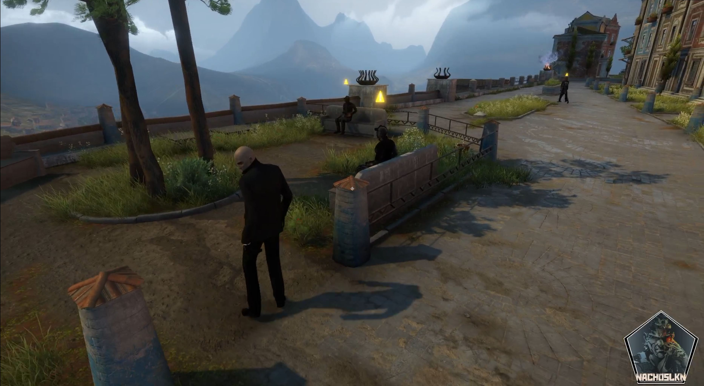
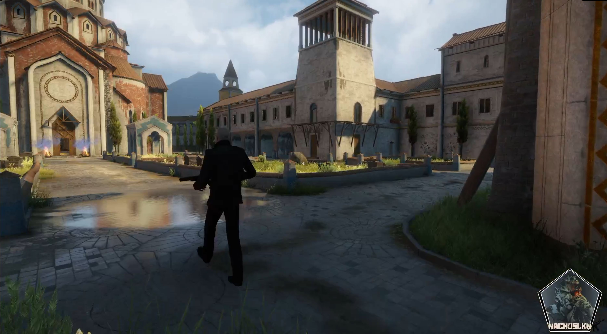
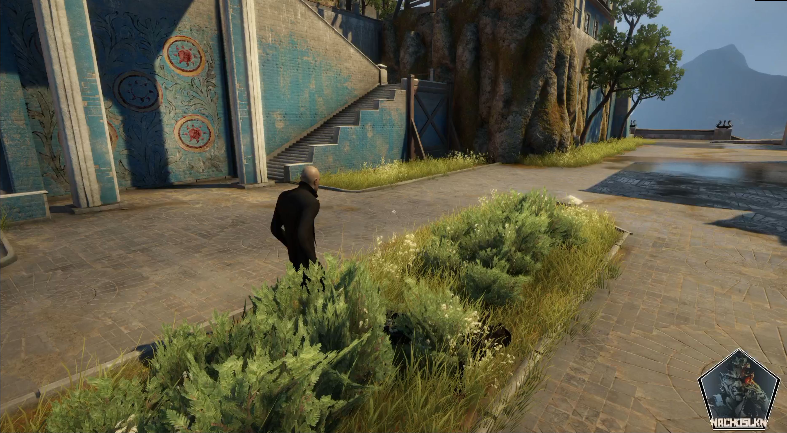

# HITMAN: Temple of the Sun

  

  <strong>Version 0.1 — First Playable Build</strong>

  A third-person stealth/action fan project developed in Unity.

  <a href="https://nachoslkn.itch.io/hitman-temple-of-the-sun">🎮 Play / Download</a>
  &nbsp; • &nbsp;
  <a href="https://youtu.be/U2zJ9ddfvJw">🎬 Gameplay Showcase</a>
  &nbsp; • &nbsp;
  <a href="https://www.youtube.com/playlist?list=PLFcvYDiIh5IM">📺 Development Playlist</a>
  &nbsp; • &nbsp;
  <a href="https://nachoslkn.com">🌐 Portfolio</a>

---

## 🎯 About the Project

**HITMAN: Temple of the Sun** is a third-person stealth/action prototype developed in **Unity and C#**, inspired by the HITMAN series.

The player takes control of an agent sent into a large environment populated by civilians and armed guards. The mission can be approached through exploration, stealth or direct combat while making your way towards the main objective and the final target.

The project focuses on experimenting with and implementing gameplay systems commonly found in third-person stealth games, including enemy AI, detection, combat, weapons, NPC behaviour and character interactions.

Version **0.1** represents the project's first publicly playable build.

---

## 🎮 Version 0.1 — First Playable Build

> ⚠️ **This is an early development build.**

Version 0.1 contains **bugs, unfinished mechanics, AI issues, visual problems and potential crashes**.

Some animations, interactions and gameplay systems still require significant polishing and certain situations may produce unexpected behaviour.

Despite these limitations, a **complete gameplay loop should be possible**:

**Mission Start → Exploration / Infiltration → Enemy Encounters → Temple → Boss Encounter → Mission Completion**

The main objective of this version is to share a playable snapshot of the project and document its current development progress.

Future versions will focus heavily on stability, bug fixing and improving the existing gameplay systems.

---

## ⚙️ Current Features

### 🕵️ Third-Person Gameplay

- Third-person character movement
- Third-person camera system
- Running and traversal
- Player health and death
- Main menu
- Pause menu
- Mission introduction and ending

### 🔫 Weapons & Combat

- Multiple weapons
- Weapon pickup
- Shooting system
- Ammunition system
- Magazine management
- Reloading
- Muzzle flash and shooting effects
- Weapon audio
- Enemy damage and health

### 👁️ Enemy AI

Guards use AI systems that allow them to react dynamically to the player.

Current behaviours include:

- Patrol routes
- Player detection
- Alert states
- Player pursuit
- Combat behaviour
- Shooting
- Damage and death
- Reactions to player attacks

Enemies can transition between different behaviours depending on what happens during the mission.

### 👥 NPCs & World

The environment contains civilians and guards distributed throughout the level to make the location feel more populated.

Implemented systems include:

- Civilian NPCs
- Guard NPCs
- AI navigation
- Waypoint-based movement
- Character animations
- Environmental interaction

### 💀 Body Interaction

Defeated characters can be interacted with and moved by the player.

This system is still experimental in **v0.1** and will receive additional improvements in future versions.

### 🎯 Mission & Boss Encounter

The current build contains a complete mission structure:

- Mission introduction
- Exploration of the environment
- Enemy encounters
- Temple infiltration
- Boss encounter
- Mission ending
- Return to the main menu

---

## 📸 Screenshots

  
  
  

---

## 🎬 Gameplay Showcase — v0.1

A short showcase of the first playable version can be watched here:

### ▶️ [Watch HITMAN: Temple of the Sun v0.1 Gameplay](https://youtu.be/U2zJ9ddfvJw)

The video demonstrates several of the systems currently implemented in the project, including exploration, combat, enemy AI and the mission gameplay loop.

---

## 🛠️ Development

The project originally began as a learning exercise while following a **WITS Gaming** Unity tutorial series.

The tutorial provided the initial foundation for learning and experimenting with systems used in a HITMAN-style third-person game.

From that foundation, the project has continued to evolve through additional implementation, experimentation, debugging and modifications.

Development work includes integrating and modifying systems such as:

- Enemy patrol and navigation
- Detection and alert behaviour
- Guard pursuit and combat
- Shooting and weapon systems
- Reloading and ammunition
- Enemy health and death
- NPC population
- Body interaction
- Boss encounter
- Mission flow
- Intro and ending sequences
- Main menu
- Pause system
- Player death handling
- Gameplay balancing
- Bug fixing and debugging
- Building and distributing a playable version

Development is ongoing and future versions are intended to continue expanding and polishing these systems.

### 📺 Development Playlist

The development process can be followed through the project's YouTube playlist:

### ▶️ [HITMAN: Temple of the Sun — Development Playlist](https://www.youtube.com/playlist?list=PLFcvYDiIh5IM)

---

## 🕹️ Controls

| Action | Control |
|---|---|
| Movement | WASD |
| Camera | Mouse |
| Shoot | Left Mouse Button |
| Reload | R |
| Interact / Pick Up | E |
| Pause | P |

Additional controls may depend on the current gameplay situation or equipped weapon.

---

## 🧰 Built With

- **Unity**
- **C#**
- Unity NavMesh / AI Navigation
- Unity Animator
- Unity Particle Systems
- Unity Audio
- Physics / Raycasting
- Third-party and external game assets

---

## 🐛 Known Issues — v0.1

This version should be considered an **early prototype**, not a finished game.

Known areas requiring further work include:

- AI behaviour can occasionally become unpredictable
- Some character animations require polishing
- Body interaction is not yet fully stable
- Some interactions can behave incorrectly
- NPC and guard behaviour needs additional refinement
- Collision issues may occur
- Mission flow still requires additional testing
- Visual and animation issues are present
- Stability improvements are required
- Crashes may occur

These issues are expected to be addressed progressively in future versions.

---

## 🚧 Future Development

Planned improvements include:

- Bug fixing and increased stability
- Improved enemy AI
- Improved detection and combat behaviour
- Better NPC behaviour
- Improved animations
- Improved body interaction
- Gameplay balancing
- Better mission flow
- Environmental interactions
- Improved visual feedback
- General gameplay polish

The objective is to continue iterating on the current playable foundation rather than treating v0.1 as a finished product.

---

## 🎮 Download the Game

**Version 0.1 is currently available as a playable Windows build on itch.io:**

### 👉 [Download HITMAN: Temple of the Sun on itch.io](https://nachoslkn.itch.io/hitman-temple-of-the-sun)

The downloadable build is provided primarily for **learning, development documentation and sharing a playable version of the project**.

---

## 🌐 Portfolio

You can find this project alongside my other game development, programming and 3D work on my personal portfolio:

### 👉 [nachoslkn.com](https://nachoslkn.com)

---

## 📚 Original Learning Resource

The project initially started while following a tutorial series by **WITS Gaming**.

The tutorial served as the original learning foundation for the project before further experimentation and development.

Credit for the original tutorial material belongs to its respective creator.

---

## ⚠️ Disclaimer

**HITMAN: Temple of the Sun is an unofficial fan-made educational project inspired by the HITMAN series.**

This project is not affiliated with, endorsed by, or associated with IO Interactive.

HITMAN and related names, characters and intellectual property belong to their respective owners.

This project has been created for learning, experimentation and portfolio purposes.

---

  <strong>HITMAN: Temple of the Sun — v0.1</strong> 
  First Playable Build

