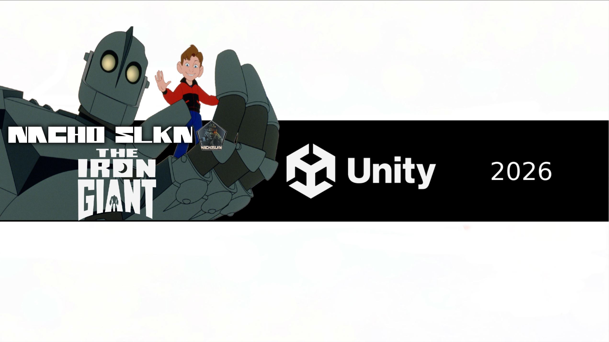

# 🤖 Gigante de Hierro

> Demo 3D desarrollada en Unity inspirada en *The Iron Giant*.  
> Proyecto personal centrado en locomoción, vuelo, combate y destrucción de escenarios.

---

## 📹 Devlog

🎥 Primer episodio del desarrollo:

https://youtu.be/KEFSmnB2Yjk

---

## 🎮 Características

- Movimiento completo en tercera persona
- Sistema de vuelo
- Animaciones mediante Mixamo
- Personaje riggeado y adaptado desde Blender
- Disparo de rayos oculares
- Sistema de War Mode (en desarrollo)
- Destrucción de objetos y escenarios
- Cámara libre
- Input System de Unity

---

## 🛠 Tecnologías

- Unity 6
- C#
- Blender
- Mixamo
- Git
- GitHub

---

## 📂 Estado del proyecto

🟡 En desarrollo.

Actualmente el proyecto se encuentra en una fase temprana donde se está construyendo toda la base técnica del personaje:

- locomoción
- vuelo
- animaciones
- interacción con el escenario
- combate
- transformación al modo guerra

El objetivo es construir una pequeña demo totalmente jugable que represente las principales habilidades del Gigante de Hierro.

---

## 📜 Créditos

Proyecto desarrollado por **NachoSLKN** como parte de mi portfolio de desarrollo de videojuegos.

No es un proyecto comercial.
Todos los derechos del personaje original pertenecen a sus respectivos propietarios.