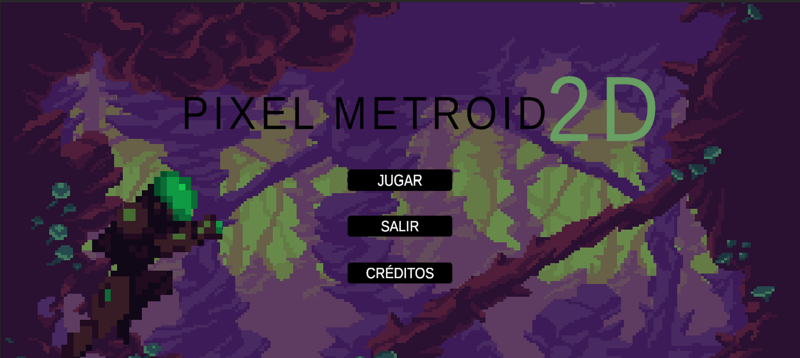
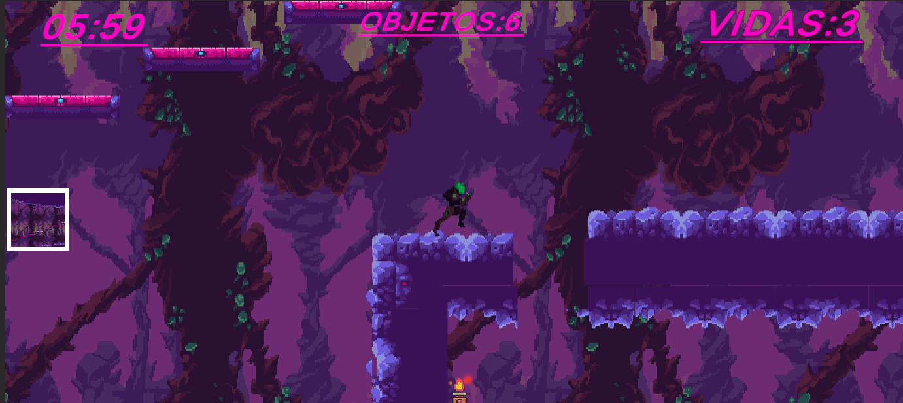
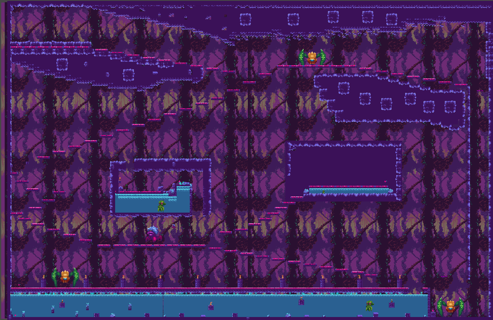

# Pixel Metroid Unity

## Descripción

**Pixel Metroid Unity** es una demo en 2D desarrollada con Unity, inspirada en el estilo clásico de Metroid.

Actualmente se trata de una versión temprana con bastante margen de mejora, pero ya incluye varios elementos clave del gameplay.

## Características actuales

- Juego en **2D**
- Sistema de **vidas**
- **Enemigos** básicos
- Efecto **parallax** en los escenarios
- Primeras mecánicas de plataformas

## Estado del proyecto

El proyecto todavía está en desarrollo y quedan muchas cosas por pulir.  
Entre las ideas futuras está la creación de un **primer nivel de naves en 2D**, que más adelante se enlazará con secciones de **plataformas 2D**.

---

📌 Este repositorio contiene **únicamente el proyecto Unity**.  
La integración con React y la GameBoy virtual se documentará en otro proyecto.
