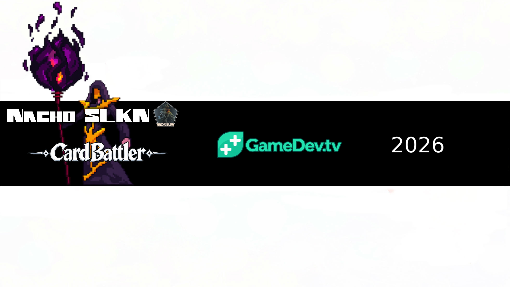
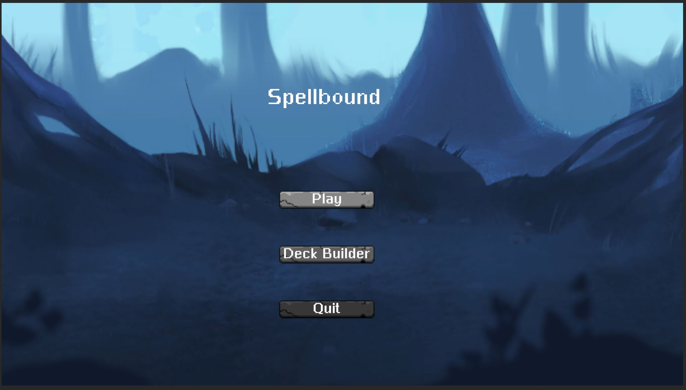
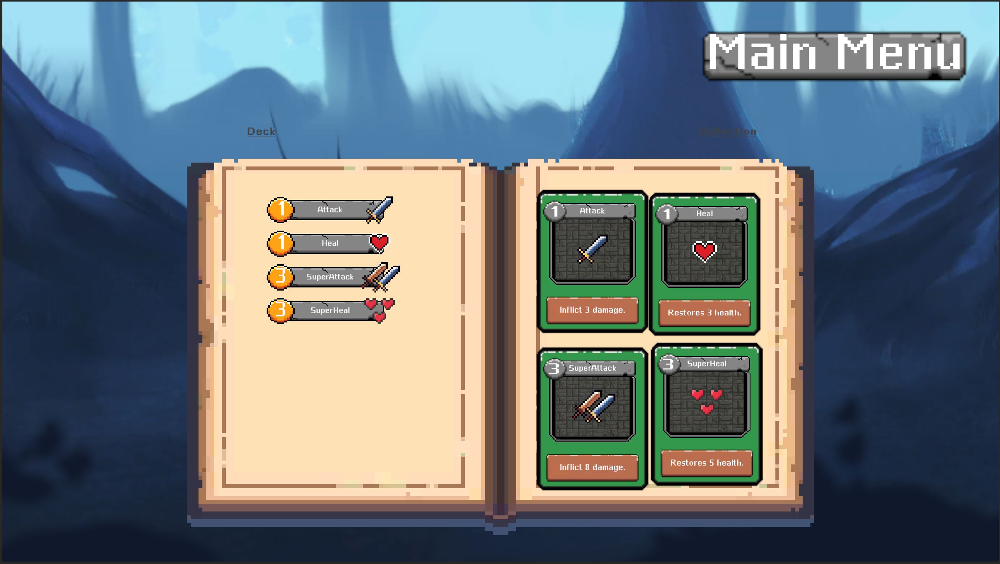
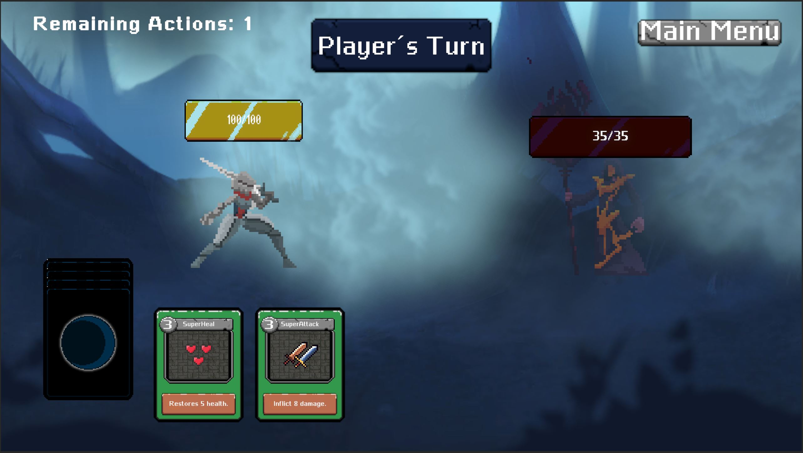

# UnityCardBattler: Spellbound

A deck-building card battler developed in Unity and C# as part of the **Unity Card Battler: Code a Deck-Building Card Game in C#** course.
The project focuses on building a complete card-based combat system, including deck management, card interactions, turn-based gameplay, boss encounters and a deck-building interface.
---
## Gameplay

Spellbound is a card battler built around managing a deck and using cards during turn-based encounters.
The project implements the complete gameplay flow through independent systems for cards, decks, turns, player actions and enemies.
---
## Card & Deck System

The card system includes:
- Card data and individual card behaviour
- Player hand management
- Default deck creation
- Draw and discard piles
- Deck management
- Card collection
- Deck-building interface
- Play and deck interaction zones
The different systems communicate through dedicated gameplay events, keeping the card, deck and turn logic separated.
---
## Combat & Turn System

Combat is managed through a turn-based system connecting the player, cards and boss encounters.
The project includes:
- Player and boss entities
- Health system
- Turn management
- Player, boss, deck and turn events
- Card play zones
- Visual hit feedback
- Audio management
- Game and menu management
---
## Project Architecture
The project is organized into several gameplay modules:
- `Cards` — cards, card data, decks, discard pile and player hand
- `DeckBuilder` — card collection and deck-building UI
- `Events` — communication between gameplay systems
- `Systems` — game, turn, deck, menu and audio management
- `Triggers` — deck and card play zones
- `Units` — player, boss, health and combat feedback
---
## Technologies
- Unity
- C#
- Unity WebGL
- ScriptableObjects
- Event-driven gameplay systems
- Turn-based game logic
- Deck-building systems
---
## Builds
Spellbound has been built and tested for:
- WebGL
- Windows
- Android
The WebGL version is used for browser-based portfolio presentation.
---
## Certificate
**Unity Card Battler: Code a Deck-Building Card Game in C#**  
Udemy — September 2026  
Instructors: GameDev.tv Team, Grant Schonhoff
[View Certificate](Certificate/udemy-unityCardBattler-certificate.png)
---
## Author
**Ignacio Liñán Vicente**
Game Development / Software Development
GitHub: **NachoSLKN**
