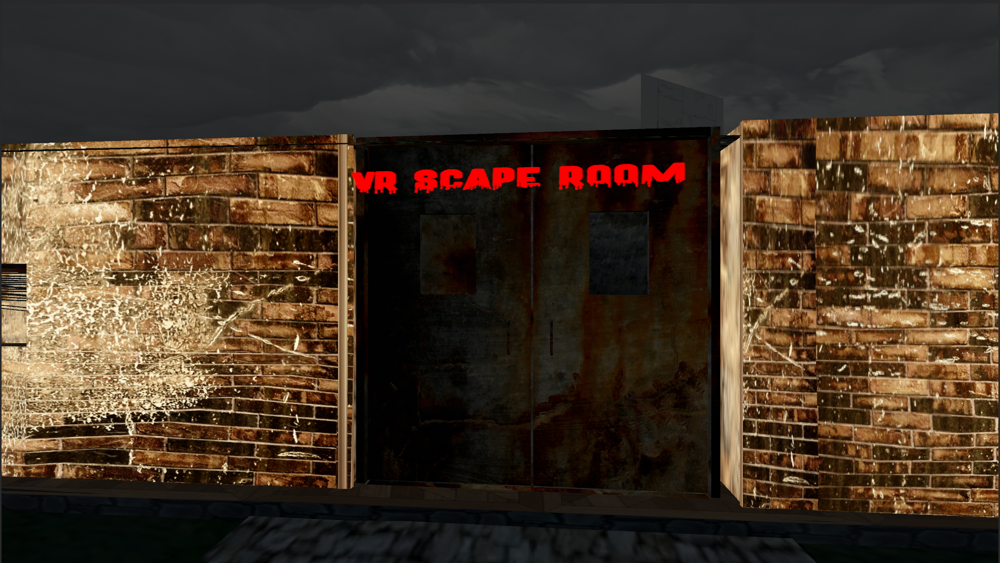

# VR Escape Room de Terror – Proyecto en Unity

Este repositorio contiene el código fuente de un **proyecto VR** desarrollado en **Unity**, ambientado en un *escape room de terror*.  
El objetivo del proyecto es crear una experiencia inmersiva donde el jugador debe resolver puzles, interactuar con el entorno y sobrevivir a una atmósfera inquietante utilizando un visor de realidad virtual.

## 🧠 Sobre el Proyecto
Este escape room VR combina:
- Interacciones físicas en VR  
- Puzles y lógica de escape  
- Elementos de terror psicológico  
- Sonido 3D envolvente  
- Mecánicas de exploración e inspección  

Actualmente el repositorio incluye **únicamente los scripts principales**, necesarios para entender la lógica del proyecto.

## 🚧 Estado del Desarrollo
Este proyecto está en fase de **depuración y expansión**.  
A medida que avance el desarrollo se subirán más elementos, tales como:

- Escenas del juego  
- Prefabs  
- Assets 3D  
- Shaders  
- Interacciones VR  
- Sistemas de IA y eventos  
- Efectos visuales y de sonido  

## 📜 Scripts incluidas
Los scripts dentro de este repositorio representan la base del comportamiento del juego:
- Interacciones VR  
- Mecánicas de objetos  
- Controladores del jugador  
- Eventos y triggers  
- Sistema de puzzles  

## 🙌 Notas
Este repositorio continuará creciendo conforme se depure y amplíe el proyecto completo.

